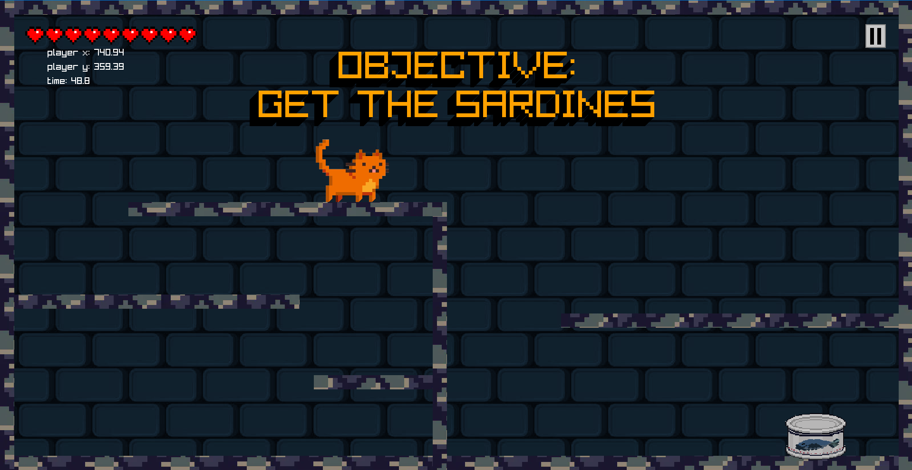

# Nine Lives
A 2D platformer game created during my first semester.

## Instructions
1. Download Raylib from [raylib.com](https://www.raylib.com).
2. Download the project ZIP file from this repository.
3. Extract the ZIP file.
4. Configure your compiler to include the Raylib source files.
5. Compile and run `main.cpp` to play the game.

## Gameplay

